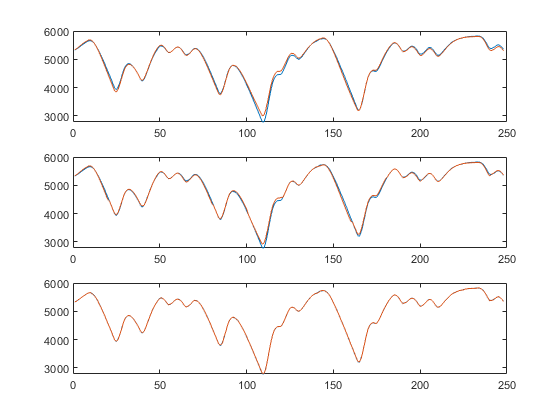
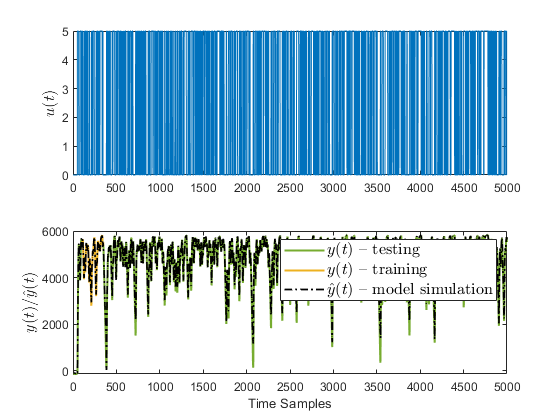
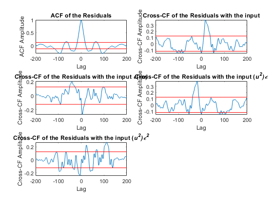
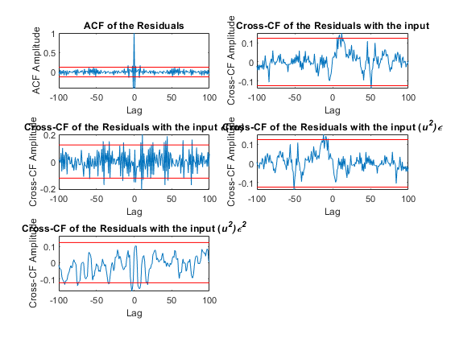

  electro\_mechanical\_example     html,body,div,span,applet,object,iframe,h1,h2,h3,h4,h5,h6,p,blockquote,pre,a,abbr,acronym,address,big,cite,code,del,dfn,em,font,img,ins,kbd,q,s,samp,small,strike,strong,tt,var,b,u,i,center,dl,dt,dd,ol,ul,li,fieldset,form,label,legend,table,caption,tbody,tfoot,thead,tr,th,td{margin:0;padding:0;border:0;outline:0;font-size:100%;vertical-align:baseline;background:transparent}body{line-height:1}ol,ul{list-style:none}blockquote,q{quotes:none}blockquote:before,blockquote:after,q:before,q:after{content:'';content:none}:focus{outine:0}ins{text-decoration:none}del{text-decoration:line-through}table{border-collapse:collapse;border-spacing:0} html { min-height:100%; margin-bottom:1px; } html body { height:100%; margin:0px; font-family:Arial, Helvetica, sans-serif; font-size:10px; color:#000; line-height:140%; background:#fff none; overflow-y:scroll; } html body td { vertical-align:top; text-align:left; } h1 { padding:0px; margin:0px 0px 25px; font-family:Arial, Helvetica, sans-serif; font-size:1.5em; color:#d55000; line-height:100%; font-weight:normal; } h2 { padding:0px; margin:0px 0px 8px; font-family:Arial, Helvetica, sans-serif; font-size:1.2em; color:#000; font-weight:bold; line-height:140%; border-bottom:1px solid #d6d4d4; display:block; } h3 { padding:0px; margin:0px 0px 5px; font-family:Arial, Helvetica, sans-serif; font-size:1.1em; color:#000; font-weight:bold; line-height:140%; } a { color:#005fce; text-decoration:none; } a:hover { color:#005fce; text-decoration:underline; } a:visited { color:#004aa0; text-decoration:none; } p { padding:0px; margin:0px 0px 20px; } img { padding:0px; margin:0px 0px 20px; border:none; } p img, pre img, tt img, li img, h1 img, h2 img { margin-bottom:0px; } ul { padding:0px; margin:0px 0px 20px 23px; list-style:square; } ul li { padding:0px; margin:0px 0px 7px 0px; } ul li ul { padding:5px 0px 0px; margin:0px 0px 7px 23px; } ul li ol li { list-style:decimal; } ol { padding:0px; margin:0px 0px 20px 0px; list-style:decimal; } ol li { padding:0px; margin:0px 0px 7px 23px; list-style-type:decimal; } ol li ol { padding:5px 0px 0px; margin:0px 0px 7px 0px; } ol li ol li { list-style-type:lower-alpha; } ol li ul { padding-top:7px; } ol li ul li { list-style:square; } .content { font-size:1.2em; line-height:140%; padding: 20px; } pre, code { font-size:12px; } tt { font-size: 1.2em; } pre { margin:0px 0px 20px; } pre.codeinput { padding:10px; border:1px solid #d3d3d3; background:#f7f7f7; } pre.codeoutput { padding:10px 11px; margin:0px 0px 20px; color:#4c4c4c; } pre.error { color:red; } @media print { pre.codeinput, pre.codeoutput { word-wrap:break-word; width:100%; } } span.keyword { color:#0000FF } span.comment { color:#228B22 } span.string { color:#A020F0 } span.untermstring { color:#B20000 } span.syscmd { color:#B28C00 } span.typesection { color:#A0522D } .footer { width:auto; padding:10px 0px; margin:25px 0px 0px; border-top:1px dotted #878787; font-size:0.8em; line-height:140%; font-style:italic; color:#878787; text-align:left; float:none; } .footer p { margin:0px; } .footer a { color:#878787; } .footer a:hover { color:#878787; text-decoration:underline; } .footer a:visited { color:#878787; } table th { padding:7px 5px; text-align:left; vertical-align:middle; border: 1px solid #d6d4d4; font-weight:bold; } table td { padding:7px 5px; text-align:left; vertical-align:top; border:1px solid #d6d4d4; }

## Contents

*   [Import data](#2)
*   [System Identification](#3)
*   [Simulate model](#4)
*   [Correlation based statistical validation OSA based](#5)
*   [Correlation based statistical validation MPO based](#6)

clear;clc
addpath('C:\\Users\\ae4159\\OneDrive - Coventry University\\PhD project\\Matlab files\\iFROs\_PRESS');
%NARX D1\_thresh = 1e-12;
%ARX D1\_thresh = 1e-10;

## Import data
'''
u = readmatrix(...
    'C:\\Users\\ae4159\\OneDrive - Coventry University\\PhD project\\Matlab files\\iFROs\_PRESS\\Example\\Electro-mecahnical system\\x\_cc.csv');
y = readmatrix(...
    'C:\\Users\\ae4159\\OneDrive - Coventry University\\PhD project\\Matlab files\\iFROs\_PRESS\\Example\\Electro-mecahnical system\\y\_cc.csv');

%--- Down sample data ---%
dwn\_smpl = 100;
u = u(1:dwn\_smpl:end);
y = y(1:dwn\_smpl:end);
'''
## System Identification

tt\_splt = 100:350; %Training data %1:10000;%500:1000;
u\_ID=u(tt\_splt);
y\_ID=y(tt\_splt);

na1=1;na2=3;%Set the maximum lags
nb1=1;nb2=3;%15%
nl\_ord\_max=2;%Set maximum order of noninearity
is\_bias=0;%Set if a bias/DC offset is required
n\_inpts=1;inpt0=ones(1,n\_inpts).\*0;
RMO=3;
sim=\[1,1\];
displ=0;

tic
\[model, Mod\_Val\_dat, iFRO\_table\_lin, iFRO\_table\_nl, best\_mod\_ind\_lin, best\_mod\_ind\_nl, val\_stats\]...
    = sys\_ID\_NARX(u\_ID,y\_ID,na1,na2,nb1,nb2,nl\_ord\_max,is\_bias,displ,sim,n\_inpts,inpt0,RMO);
toc

disp('ARX model:'); disp(iFRO\_table\_lin{best\_mod\_ind\_lin,1});
disp('NARX model:'); tbl\_NARX = join(iFRO\_table\_nl{best\_mod\_ind\_nl,10},...
    iFRO\_table\_nl{best\_mod\_ind\_nl,1});disp(tbl\_NARX);

\--------------------
MSSE = 3601.6419
MSkPE = 2017.5142
MSPE = 66.0511
--------------------
Elapsed time is 0.291572 seconds.
ARX model:
                  ERR         theta 
               \_\_\_\_\_\_\_\_\_\_    \_\_\_\_\_\_\_

    y1(t-1)     0.0035628     2.4274
    y1(t-2)    0.00010674    -1.9559
    y1(t-3)        0.9963    0.52645
    u1(t-1)    1.3124e-05     10.668
    u1(t-3)    3.8288e-06    -6.8021

NARX model:
                      MS\_PRESS\_E      theta         ERR    
                      \_\_\_\_\_\_\_\_\_\_    \_\_\_\_\_\_\_\_\_    \_\_\_\_\_\_\_\_\_\_

    y1(t-1)               8128.5       1.7844       0.49526
    y1(t-2)               975.85     -0.79156    0.00028497
    u1(t-1)               318.88       47.205    2.6363e-05
    y1(t-2)u1(t-1)        158.23    -0.037612     6.211e-06
    y1(t-3)u1(t-1)    1.2306e+07     0.030086       0.50441
    u1(t-2)u1(t-2)        91.271         1.89    2.5147e-06
    u1(t-2)u1(t-3)        71.842     -0.91694    7.2261e-07

## Simulate model

\[sse, y\_hat, error, U\_delay\_mat\_sim\] = model\_simulation(model,u,y,20);
disp(\['RMSE = ',num2str( sqrt(mean(error(:,1).^2)) )\]);
disp(\['Error variance = ',num2str( var(error(:,1)) )\]);

%----------
figure;
subplot(2,1,1); plot(u, 'Color', '#0072BD');
ylabel('$u(t)$','Interpreter','latex','FontSize',12);
%----------
n = length(y);
subplot(2,1,2);
plot(1:n, y,'Color', '#77AC30', 'LineWidth',1.5); hold on;
plot(tt\_splt, y\_ID, 'Color', '#EDB120','LineWidth',1.5); hold on;
plot((length(y)-length(y\_hat)+1:n), y\_hat(:,3), 'k-.', 'LineWidth',1.25);
legend('$y(t)$ -- testing', '$y(t)$ -- training','$\\hat{y}(t)$ -- model simulation','Interpreter','latex','FontSize',12);
xlabel('Time Samples');
ylabel('$y(t)/\\hat{y}(t)$','Interpreter','latex','FontSize',12);
%----------

RMSE = 177.6604
Error variance = 26015.6385

## Correlation based statistical validation OSA based

e\_ct = error(tt\_splt,1);
u\_ct = U\_delay\_mat\_sim(tt\_splt,1);
u\_ct = u\_ct - mean(u\_ct);
u\_ct = u\_ct ./ std(u\_ct);
e\_ct = e\_ct - mean(e\_ct);
e\_ct = e\_ct ./ std(e\_ct);
\[~,~\] = ac\_cc\_model\_valid\_nl(e\_ct,u\_ct,200,1);

## Correlation based statistical validation MPO based

e\_ct = error(tt\_splt,2);
u\_ct = U\_delay\_mat\_sim(tt\_splt,1);
u\_ct = u\_ct - mean(u\_ct);
u\_ct = u\_ct ./ std(u\_ct);
e\_ct = e\_ct - mean(e\_ct);
e\_ct = e\_ct ./ std(e\_ct);
\[~,~\] = ac\_cc\_model\_valid\_nl(e\_ct,u\_ct,100,1);

  
[Published with MATLAB® R2024b](https://www.mathworks.com/products/matlab/)
