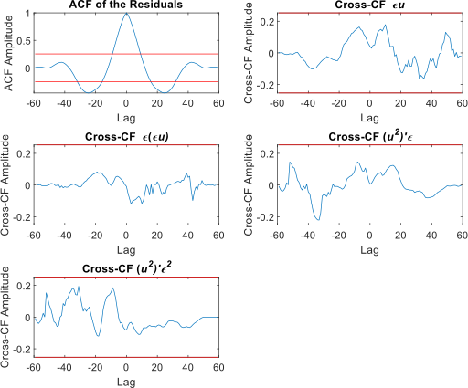

# Summary
System identification lies at the intersection of control theory, dynamic systems theory and machine learning, involving the construction of mathematical models of complex dynamic linear or nonlinear systems using input-output data, enabling the prediction of system behaviour and analysis in both time and frequency domains. This approach can model the entire system or capture specific dynamics within it. For meaningful analysis, it is essential that the model accurately reflects the underlying system behaviour. This paper introduces `NonSysId`, an open-source MATLAB software package designed for nonlinear system identification, specifically focusing on NARMAX models. The software incorporates an advanced term selection methodology that prioritises simulation (free-run) accuracy while preserving model parsimony. A key feature is the integration of iterative Orthogonal Forward Regression (iOFR) with Predicted Residual Sum of Squares (PRESS) statistic-based term selection, facilitating robust model generalisation without the need for a separate validation dataset. Furthermore, techniques for reducing computational overheads are implemented. These features make `NonSysId` particularly suitable for real-time applications, such as structural health monitoring, fault diagnosis, and biomedical signal processing, where capturing signals under consistent conditions is challenging, resulting in limited or no validation data.

# Statement of Need

The package focuses on discrete-time polynomial nonlinear auto-regressive with exogenous input (NARX) models, with ARX as the linear special case. Here, the polynomial functional mapping relates past input/output terms (input/output lagged terms) to the current output. Polynomial NARX models are equivalent to RNNs [@Sum1999] and are widely used in fields such as control, condition monitoring, advanced manufacturing, and the modelling and analysis of physiological and biological systems [@Chiras2002;@WANG2024;@ZAINOL2022;@RITZBERGER2017;@Gao2023;@HE2016;@HE2021;@LIU2024]. Extending the NARX model with a noise model produces the NARMAX model.

The core challenge is identifying a parsimonious structure from a large set of candidate terms, as redundant terms may induce significant spurious dynamics [@AGUIRRE1995; @mendes1998a]. The Orthogonal Forward Regression (OFR) algorithm, also known as FROLS [@chen1989b; @billings1987a], evaluates the independent contribution of each candidate term to the output according to a term selection criterion [@korenberg1988a; @WANG1996; @hong2003], enabling efficient step-wise forward selection of terms. Using the error reduction ratio (ERR), a common criterion, the OFR incrementally selects terms that maximise the explained variance (model fit). Recently, two open-sourced packages for system identification have been introduced: `SysIdentPy` [@Lacerda2020] for Python and the `narmax` package [@AYALA2020] for R. Both packages, based on the original OFR algorithm, are well-developed and comprehensive. However, the traditional OFR method (using ERR) has known limitations [@Piroddi2003; @Mao1997]. These include the selection of redundant/incorrect terms, overfitting and inaccuracies/instability in long-horizon simulation (free-run or model-predicted output). These arise from inputs that do not persistently excite the system under consideration (i.e., inputs don't excite all system dynamics effectively) or from complex noise structures [@Piroddi2003;@Mao1997]. Furthermore, models must generalise well to unseen data, typically assessed through cross-validation [@Little2017; @Stone1974]. However, in some real-time applications, such as structural health monitoring or fault diagnosis, obtaining separate validation data may be impractical [@Gharehbaghi2022; @Vamsikrishna2024]. In neuroscience, rapidly changing complex dynamics between brain regions make it difficult to obtain data precisely containing the same behaviour for validation purposes [@Kunjan2021; @Seedat2024; @Chen2016; @Eichenbaum2021; @Lehnertz2021]. The following section outlines the features in the `NonSysId` package, specifically developed to address these challenges.

# Features in `NonSysId`

The `NonSysId` package introduced in this paper implements an OFR-based system identification methodology designed to address the key issues outlined in the previous section. This is achieved by integrating and extending several OFR variants already available in the literature [@guo2015a;@WANG1996;@hong2003], and a simulation-based model selection procedure proposed here. At the time of writing, `NonSysId` is the only open-source package that implements previously proposed solutions to overcome the limitations of the original OFR algorithm. 

To address these limitations, the `NonSysId` package incorporates the iterative OFR (iOFR) algorithm [@guo2015a], simulation-based stability tests (bounded-input bounded-output), and model selection techniques for improved long-horizon prediction and stability. Specifically, the candidate models generated at each iteration of iOFR are simulated using constant inputs of zeros and ones separately. If the corresponding model outputs remain bounded with a small variance, typically less than $10^{-2}$, the model is regarded as stable. From this set of stable models, the Bayesian Information Criterion (BIC) [@Schwarz1978; @Stoica2004], based on the mean squared simulated error (MSSE) [@Piroddi2003], is used to select the best model for the current iteration. Furthermore, the package integrates the PRESS-statistic-based [@Allen1974] term selection criterion [@WANG1996; @hong2003], enabling efficient stepwise forward selection of terms that minimise the one-step-ahead leave-one-out cross-validation error. These enhancements provide robust term selection (compared to OFR-ERR), built-in cross-validation, and models with improved long-horizon prediction capabilities and simulation stability [@AGUIRRE2010]. For NARX models, the candidate term set can be extensive and computationally demanding in the iFRO algorithm [@chen1989b; @billings1987a; @guo2015a]. `NonSysId`, following [@Wei2004] and [@guo2015a], incorporates strategies to accelerate the iterative stepwise forward selection process. Additionally, the package includes correlation-based residual analysis techniques for validating nonlinear models [@Billings1983]. These features make `NonSysId` particularly suitable for real-time applications where inputs may not be persistently exciting and separate validation datasets may be unavailable. For more details on the `NonSysID`, please refer to the documentation in the GitHub repository (\url{https://github.com/raj-gun/NonSysID}).

# Examples

This section presents examples from the NonSysID package, which implements $\text{iOFR}_{S}$ with PRESS-based term selection, utilising synthetic data from a NARX model and real data from an electromechanical system.

## Synthetic data example

The following example demonstrates how to identify a NARX model using the `NonSysId` package. In this example, we consider a NARX model of a DC motor (\autoref{eq:NARX_eg}) as described in [@Lacerda2017].
\begin{multline} \label{eq:NARX_eg}
    y(t) = 1.7813y(t-1) - 0.7962y(t-2) + 0.0339u(t-1) + 0.0338u(t-2)\\
    - 0.1597y(t-1)u(t-1) - 0.1396y(t-1)u(t-2)\\
    + 0.1297y(t-2)u(t-1) + 0.1086y(t-2)u(t-2) + 0.0085y(t-2)^2
\end{multline}
In \autoref{eq:NARX_eg}, $y(t)$ is the output and $u(t)$ is the input at the time sample $t$. The NARX model is excited using two inputs: (a) White noise, $u(t)\sim\mathcal{N}(0,1)$, and (b) a multi-tone sinusoidal, $u(t) = 0.2\big( 4\sin{(\pi t)} + 1.2\sin{(4\pi t)} + 1.5\sin{(8\pi t)} + 0.5\sin{(6\pi t)} \big)$. Matlab scripts for this example are available in the code repository, along with documentation in the code repository, which provides a straightforward guide for using $\text{iOFR}_{S}$ in the `NonSysId` package.

\autoref{fig:narx_eg_a_io} and \autoref{fig:narx_eg_b_io} depict the training and testing data alongside the model-simulated output,  $\hat{y}(t)$, for the inputs (a) and (b), respectively. `Testing data` refers to data not explicitly included during training, as the model is already cross-validated during the identification/training process.

\autoref{tbl:inpt_a_param} and \autoref{tbl:inpt_b_param} list the identified terms and parameter values of the NARX models for inputs (a) and (b), along with the mean squared PRESS error and ERR for each term. The PRESS error estimates the predicted cross-validation error at each step, while sorting the tables by PRESS error reveals the order of term inclusion during forward selection. ERR indicates the portion of the output variance explained by each term.

{width="80%"}

{width="80%"}

| Model term        |  Mean squared PRESS error    | ERR                     | Parameters/Coefficients |
|-------------------|------------------------------|-------------------------|-------------------------|
| $y(t-1)$          | $1.342 \times 10^{-3}$       | $0.95001$               | $\ \ 1.7813$            |
| $y(t-2)$          | $1.6759 \times 10^{-4}$      | $2.255 \times 10^{-3}$  | $-0.7962$               |
| $u(t-1)$          | $0.47871$                    | $4.7434 \times 10^{-2}$ | $\ \ 0.0339$            |
| $u(t-2)$          | $6.8123 \times 10^{-5}$      | $1.8925 \times 10^{-4}$ | $\ \ 0.0338$            |
| $y(t-1)u(t-1)$    | $2.2653 \times 10^{-5}$      | $3.6489 \times 10^{-5}$ | $-0.1597$               |
| $y(t-1)u(t-2)$    | $6.1439 \times 10^{-5}$      | $1.9004e \times 10^{-5}$| $-0.1396$               |
| $y(t-2)y(t-2)$    | $3.1515 \times 10^{-30}$     | $5.3837e \times 10^{-7}$| $\ \ 0.0085$            |
| $y(t-2)u(t-1)$    | $3.7241 \times 10^{-7}$      | $2.9966e \times 10^{-5}$| $\ \ 0.1297$            |
| $y(t-2)u(t-2)$    | $4.6109 \times 10^{-5}$      | $2.8901e \times 10^{-5}$| $\ \ 0.1086$            |
: The model identified when \autoref{eq:NARX_eg} is excited with input (a), white noise \label{tbl:inpt_a_param}

| Model term        |  Mean squared PRESS error    | ERR                     | Parameters/Coefficients |
|-------------------|------------------------------|-------------------------|-------------------------|
| $y(t-1)$          | $1.2209 \times 10^{-4}$      | $0.1035$                | $\ \ 1.7813$            |
| $y(t-2)$          | $7.0858 \times 10^{-7}$      | $1.7841 \times 10^{-4}$ | $-0.7962$               |
| $u(t-1)$          | $2.8085 \times 10^{-9}$      | $2.5768 \times 10^{-9}$ | $\ \ 0.0339$            |
| $u(t-2)$          | $3.7183 \times 10^{-8}$      | $3.5856 \times 10^{-7}$ | $\ \ 0.0338$            |
| $y(t-1)u(t-1)$    | $4.5778 \times 10^{-12}$     | $2.7792 \times 10^{-9}$ | $-0.1597$               |
| $y(t-1)u(t-2)$    | $2.9234 \times 10^{-7}$      | $6.0493 \times 10^{-7}$ | $-0.1396$               |
| $y(t-2)y(t-2)$    | $3.8123 \times 10^{-9}$      | $4.6086 \times 10^{-8}$ | $\ \ 0.0085$            |
| $y(t-2)u(t-1)$    | $1.9182 \times 10^{-25}$     | $6.4198 \times 10^{-12}$| $\ \ 0.1297$            |
| $y(t-2)u(t-2)$    | $7.0559 \times 10^{-2}$      | $0.89632$               | $\ \ 0.1086$            |
: The model identified when \autoref{eq:NARX_eg} is excited with input (b), a multi-tone sinusoid \label{tbl:inpt_b_param}

The correlation-based statistical validation tests for nonlinear models [@Billings1983], \autoref{fig:narx_eg_a_val} and \autoref{fig:narx_eg_b_val}, indicate model bias. However, it is minor, the residual variances, $1.6018 \times 10^{-25}$ for (a) and $8.2178 	imes 10^{-18}$ for (b), are negligible compared to the output variances of $0.069$ and $0.0581$, respectively.

{width="70%"}

{width="70%"}

## Real data example

The real data in this example is obtained from an electromechanical system described in [@Lacerda2017b]. The system comprises two DC motors, one as a driver and the other as a generator, mechanically coupled by a shaft. The input is the voltage applied to the driver motor. This input is a pseudo-random binary signal (PRBS) designed to excite the system over a range of dynamics. The system output is the rotational speed (angular velocity) of the generator motor.

{width="100%"}

![**Model validation results for the system in [@Lacerda2017b]**. The red bounds indicate the tolerances the correlation function should stay within for the identified model to be unbiased.\label{fig:narx_eg_rldt_val}](Figures/ele_mech_sysId_vald_mpo.svg){width="100%"}

| Model term        |  Mean squared PRESS error   | ERR                     | Parameters/Coefficients |
|-------------------|-----------------------------|-------------------------|-------------------------|
| $y(t-1)$          | $8128.5$                    | $0.49526$               | $\ \ 1.7844$            |
| $y(t-2)$          | $975.85$                    | $0.00028497$            | $-0.79156$              |
| $u(t-1)$          | $318.88$                    | $2.6363 \times 10^{-5}$ | $\ \ 47.205$            |
| $y(t-2)u(t-1)$    | $158.23$                    | $6.211 \times 10^{-6}$  | $-0.037612$             |
| $y(t-3)u(t-1)$    | $1.2306 \times 10^{7}$      | $0.50441$               | $\ \ 0.030086$          |
| $u(t-2)u(t-2)$    | $91.271$                    | $2.5147 \times 10^{-6}$ | $\ \ 1.89$              |
| $u(t-2)u(t-3)$    | $71.842$                    | $7.2261 \times 10^{-7}$ | $-0.91694$              |
: The model identified from the data generated from the system in [@Lacerda2017b] \label{tbl:narx_eg_rldt_val}

# Future Work
The NonSysId package currently supports the identification of single-input single-output (SISO) and multi-input single-output (MISO) models, with correlation-based residual analysis being limited to SISO models. Future updates will extend support to multi-input multi-output (MIMO) identification and enable validation for MISO and MIMO systems. While the package now handles polynomial NARX models, upcoming versions will expand $\text{iOFR}_{S}$ to broader basis functions. A Python open-source release is also planned.

# Acknowledgements
RG and FH were supported by EPSRC grant [EP/X020193/1].

# References

