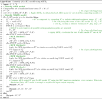
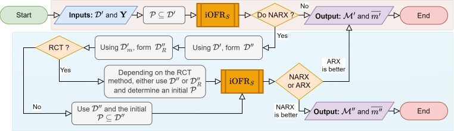

# NonSysId: Nonlinear System Identification with Improved Model Term Selection for NARMAX Models  
*An open-source MATLAB package for system identification of ARX, NARX and (N)ARMAX models, featuring improved term selection and robust long-term simulation capabilities.*

Authors: Rajintha Gunawardena (https://github.com/raj-gun), Zi-Qiang Lang, Fei He (https://github.com/feihelab)

# Statement of need

System identification is a field at the intersection of control theory,
dynamic systems theory and machine learning that seeks to derive
mathematical models of dynamic linear or nonlinear systems based on
experimental input-output data. Generally, system identification has two
primary objectives \[1\], \[2\], (i) to accurately map the system’s
inputs and outputs, allowing for the prediction of new, unseen data, and
(ii) to capture the underlying dynamics of the system within the model.

The dynamic models generated through system identification can be either
discrete or continuous time models \[3\]. This paper centres on
widely-used discrete-time models, specifically nonlinear auto-regressive
models with exogenous inputs (NARX), where the ARX model is a linear
variant of the NARX framework. These input-output time-series models
predict future outputs of a system based on its historical input and
output instances. NARX models have been applied extensively to model and
analyse complex systems in fields such as control, condition monitoring,
advanced manufacturing and the modelling and analysis of physiological
and biological systems \[4\]–\[11\]. Moreover, it has been demonstrated
that the NARX model has equivalence to a recurrent neural network (RNN)
\[12\]. Extending the NARX model to incorporate a noise model, we obtain
the nonlinear auto-regressive moving average with exogenous inputs
(NARMAX) model.

Recently two open-sourced packages have been introduced, ‘SysIdentPy’
\[13\] for Python and the ‘narmax’ package \[14\] for R. Both packages
are well-developed and comprehensive. However, they are based on the
original forward regression orthogonal least squares (OFR) algorithm,
which has been noted to have several limitations, as discussed in
\[15\], \[16\]. These concerns primarily involve over-fitting and
inaccurate long-horizon predictions, particularly when the input fails
to sufficiently excite the actual system. Additionally, in some
applications, acquiring extra data for cross-validation may be
infeasible. As a result, developing parsimonious models that can
generalise well to unseen data becomes crucial in such cases. This paper
introduces the ‘NonSysId’ package, which incorporates an enhanced model
selection process to address these challenges.

In the context of (N)ARX models, system identification is employed to
determine a specific functional relationship that maps past input
instances (input-lagged terms),

``` math
U = \Big\{ u(t-1)\ ,\ u(t-2)\ ,\ \cdots,\ u(t-n_b) \Big\},    \ \ \ \ \ \ \ \ \ \ \ \ \ \ \ \ \ \ \ \ \ \ \ \ \ \ \ \ \ \ \ \ \ \ \ \    (1)
```

and past output instances (output-lagged terms),

``` math
Y = \Big\{ y(t-1)\ ,\ y(t-2)\ ,\ \cdots,\ y(t-n_a) \Big\},    \ \ \ \ \ \ \ \ \ \ \ \ \ \ \ \ \ \    (2) 
```

to the present output instance in time $`y(t)`$. $`t`$ here refers to a
time index (i.e. $`t`$<sup>th</sup> sample). $`n_a`$ and $`n_b`$ are the
maximum number of past output and input time instances considered and
are related to the Lyapunov exponents of the actual system that is being
modelled \[17\]. The functional mapping is described by the following
equation:

``` math
y(t) = f^{P}\bigl( Y, U \bigr) + \xi(t),   \ \ \ \ \ \ \ \ \ \ \ \ \ \ \ \ \ \ \ \ \ \ \ \ \ \ \ \ \ \ \ \ \ \ \ \ \ \ \ \ \ \ \ \ \ \ \    (3)
```

where $`y(t)`$ and $`u(t)`$ refer to the output and input respectively,
while $`\xi(t)`$ represents the error between the predicted output
$`f^{P}\bigl( Y, U \bigr)`$ and the actual output $`y(t)`$ at time
instance $`t`$. $`\xi(t)`$ will contain noise and unmodeled dynamics.
$`f^{P}( \ )`$ is the functional mapping between the past inputs and
outputs to the current output $`y(t)`$. This mapping can take the form
of a polynomial, a neural network, or even a fuzzy logic-based model.
Here, we focus on polynomial NARX models with a maximum polynomial
degree $`N_p \in \mathbb{Z}^{+}`$. In this case, Eq. (3) can be expressed as

``` math
y(t) = \sum_{m=1}^{M} \theta_{m} \times \phi_{m}(t) + \xi(t),   \ \ \ \ \ \ \ \ \ \ \ \ \ \ \ \ \ \    (4)
```

where $`m = 1, \cdots, M`$, $`M`$ being the total number of variables or
model terms. $`\theta_{m}`$ are the model parameters or coefficients and
$`\phi_{m}(t)`$ are the corresponding model terms or variables.
$`\phi_{m}(t)`$ are $`n`$<sup>th</sup>-order monomials of the polynomial
NARX model $`f^{P}( \ )`$, where $`n = 1, \cdots, N_p`$ is the degree of
the monomial. $`\phi_{m}(t)`$ is composed of past output and input time
instances from $`Y`$ and $`U`$. An example of a polynomial NARX model
can be

``` math
y(t) = \theta_{1}y(t-1) + \theta_{2}u(t-2) + \theta_{3}y(t-2)^{2}u(t-1)^{3} + \xi(t).    \ \ \ \ \ \ \ \ \ \ \ \ \ \ \ \ \ \    (5)
```


In this example, $`\phi_{1}(t)=y(t-1)`$ and $`\phi_{2}(t)=u(t-2)`$ have
a degree of 1 and are the linear terms (1<sup>st</sup> order monomials
or linear monomials) of the model.
$`\phi_{3}(t) = y(t-2)^{2}u(t-1)^{3}`$ is a nonlinear term with a degree
of $`5`$ (5<sup>th</sup> order monomial, more generally a nonlinear
monomial). The NARX model given in Eq. (5) has a polynomial
degree $`N_p=5`$ (highest degree of any monomial). Given that the total
number of time samples available is $`L`$, where $`t = 1, \cdots, L`$,
Eq. (4)
can be represented in matrix form as

``` math
\mathbf{Y} = \mathbf{\Phi} \mathbf{\Theta} + \mathbf{\Xi},    \ \ \ \ \ \ \ \ \ \ \ \ \ \ \ \ \ \    (6)
```

where $`\mathbf{Y} = \left[ y(1), \cdots, y(L) \right]^T`$ is the vector
containing the output samples $`y(t)`$.
$`\mathbf{\Phi} = \left[ \bar{\phi}_{1}, \cdots, \bar{\phi}_{M} \right]`$,
where
$`\bar{\phi}_{m} = \left[ \phi_{m}(1), \cdots, \phi_{m}(L) \right]^T`$
is the vector containing all time samples of the model term
$`\phi_{m}(t)`$.
$`\mathbf{\Theta} = \left[ \theta_{1}, \cdots, \theta_{M}  \right]^T`$
is the parameter vector and
$`\mathbf{\Xi} = \left[ \xi(1), \cdots, \xi(L) \right]`$ is the vector
containing all the error terms $`\xi(t)`$ (i.e. model residuals). In the
NARMAX model structure, a moving-average (MA) component is added to the
NARX (Eq. (4))
by incorporating linear and nonlinear lagged error terms (e.g.,
$`\xi(t-2)`$, $`\xi(t-1)\xi(t-3)`$). This noise model accounts for
unmodeled dynamics and coloured noise, effectively isolating noise from
the deterministic system and thereby reducing model bias \[2, Ch. 3\].

The primary challenge in learning a polynomial NARX model is to identify
the polynomial structure of the model, i.e. selecting which terms from a
set of candidate model terms (monomials), denoted as $`\mathcal{D}`$,
should be included in the model. For instance, a potential set of
candidate terms could be

``` math
\mathcal{D} = \Big\{ 
              y(t-1), y(t-2), u(t-1), u(t-2), 
              y(t-1)u(t-2), y(t-2)u(t-1)^{3}, 
              y(t-2)^{2}u(t-1), y(t-2)^{2}u(t-1)^{3}
        \Big\} ,    \ \ \ \ \ \ \ \ \ \ \ \ \ \ \ \ \ \    (7)
```

from which a NARX model structure, such as that in Eq. (5), can be identified.
Once the model structure is identified, the next step is to estimate the
model parameters. However, determining the appropriate linear and
nonlinear terms to include in the model structure is critical to
achieving parsimonious models. This is particularly important in the
nonlinear cases \[2, Ch. 1\], as the inclusion of unnecessary model
terms, can result in a model that erroneously captures dynamics that do
not belong to the underlying system \[17\], \[18\].

The Orthogonal Forward Regression (OFR) algorithm, also known as Forward
Regression OLS (FROLS) \[19\], \[20\], is based on the Orthogonal Least
Squares (OLS). When combined with an appropriate term selection
criterion \[21\]–\[23\], it efficiently selects model terms (regressors)
in a forward, sequential manner. In this approach, model terms are added
one at a time based on a selection criterion, facilitating the
development of a parsimonious model. The OFR/FROLS algorithm evaluates
the impact of each term on the output independently of the influence of
other terms, achieved through orthogonalization procedures. This
evaluation relies on the chosen term selection criterion, allowing for
the sequential inclusion of appropriate terms in the final model using a
forward selection approach. The most commonly used and widely accepted
model term selection criterion used in the OFR algorithm is the error
reduction ratio (ERR). During the forward selection procedures, the ERR
selects the term that maximises explained variance, thereby maximise the
goodness of fit. Over the years, many variants of the OFR have been
proposed. However, concerns persist regarding the original OFR algorithm
(OFR-ERR), which relies on the ERR for term selection \[15\], \[16\],
for example,

1.  OFR-ERR may select redundant or incorrect model terms, especially in
    the presence of complex noise structures or certain input signals;

2.  The model structures produced from OFR can be sensitive to the first
    term selected in the forward selection of model terms;

3.  If the input does not persistently excite the system under
    consideration (i.e. it lacks the informativeness needed to
    effectively stimulate the system), the resulting model can be
    inappropriate. This can result in inaccuracies in long-horizon
    prediction and, in some cases, even unstable models during
    simulation (free-run or model-predicted output);

4.  The ERR focuses solely on explained variance when selecting terms,
    which can lead to overfitting.

Beyond obtaining parsimonious models, the model should generalise well
to unseen data (validation) that is not used during the
learning/training process (i.e. model identification). This is referred
to as obtaining a bias-variance trade-off, which can be achieved through
an appropriate cross-validation strategy \[24\], \[25\]. However, in
some applications, obtaining separate validation data is not feasible.
This is particularly true in real-time system identification
applications, such as structural health monitoring or fault diagnosis
\[26\], \[27\]. Another example arises in neuroscience, where the
dynamics between brain regions are highly time-varying and can change
within milliseconds. As a result, obtaining electrophysiological data
that precisely captures such behaviour is often challenging, if not
impossible \[28\]–\[32\]. These challenges are critical when applying
system identification to specific domains. The following section
outlines the features in the ‘NonSysId’ package, designed to address
these issues.

# Features in NonSysId

The ‘NonSysId’ package introduced in this paper implements an OFR-based
system identification methodology designed to address the key issues
mentioned in the latter part of the previous section. This is achieved
by integrating and extending several OFR variants already available in
the literature \[22\], \[23\], \[33\], along with a proposed
simulation-based model selection procedure. A notable feature of
‘NonSysId’ is the implementation of the iterative-OFR (iFRO) variant
\[33\] of the OFR algorithm. Additionally, the PRESS-statistic-based
term selection \[22\], \[23\] is integrated with the iOFR, complemented
by simulation-based model selection. These enhancements enable robust
term selection (compared to the ERR), built-in cross-validation, and the
ability to produce models with long-horizon prediction capabilities and
simulation stability \[34\]. With these features, the ‘NonSysId’ package
makes system identification feasible for real-time applications, such as
fault diagnosis in engineering or the analysis of electrophysiology
activity in medical settings, where inputs may not be persistently
exciting and separate datasets for validation may be unavailable.
‘NonSysId’ is the only open-sourced package that directly address the
limitations of the original OFR algorithm. For NARX models, where the
candidate term set can be extensive and computationally demanding in the
iFRO algorithm, ‘NonSysId’ incorporates methods to reduce the candidate
term set, significantly speeding up the forward selection process.
Moreover, the package includes correlation-based residual analysis
techniques for nonlinear model validation \[35\].

## Iterative OFR

To address the concerns associated with the original OFR, the
iterative-OFR (iOFR) algorithm was introduced in \[33\]. To the best of
our knowledge, no open-source software implementing this variant
currently exist. In the original OFR, the term selection is heavily
influenced by the order of orthogonalization, which can often result in
incorrect terms being selected in the early stages \[16\], \[33\].
Additionally, the order in which terms are selected in the OFR
determines orthogonalization path, resulting in a tree structure of
possible models \[16\], \[33\]. Finding a globally optimal solution
would require an exhaustive search through all orthogonalization paths -
an infeasible task given the factorial growth in paths ($`k!`$ paths for
$`k`$ terms). The iOFR algorithm addresses this limitation by
iteratively exploring multiple orthogonalization paths and re-selecting
terms to approximate a globally optimal model without exhaustive search
\[33\]. This approach enables the recovery of correct terms that might
have been overlooked in earlier iterations. As a result, the iOFR
generates several candidate models for consideration.

The iOFR procedures \[33\] can be summarised as follows. Given an output
vector $`\mathbf{Y}`$, a set of candidate terms $`\mathcal{D}`$ and a
set of pre-select terms $`\mathcal{P} \subseteq \mathcal{D}`$, where
$`\mathcal{P} = \{ \phi_1 , \dots, \phi_p  \}`$, 1) pre-select each term
given in $`\mathcal{P}`$ as the first model term; 2) use OFR to search
through $`p`$ orthogonalization paths resulting in a set of $`p`$
candidate models $`\mathcal{M} = \{ m_1, \dots, m_p \}`$; 3) from
$`\mathcal{M}`$, select the best model $`\overline{m}`$ based on the
one-step-ahead prediction error; and 4) update the set of pre-select
terms $`\mathcal{P}`$ with the terms in $`\overline{m}`$. The process is
repeated iteratively with the updated $`\mathcal{P}`$ to search through
different orthogonalization paths.

As shown in \[33\], the iOFR can iteratively produce more globally
optimal model structures. This is because optimal solutions are only
found along orthogonalization paths that begin with a correct term
\[16\], \[33\] (candidate terms essential for accurately reconstructing
dynamics of the original system \[17\], \[36\]). Although the best model
$`\overline{m}`$ obtained in each iteration may be sub-optimal, it will
include certain correct terms \[33\]. Consequently, in subsequent
iterations, $`\mathcal{P}`$ will contain fewer redundant model terms.
This refinement ensures that, in the next iteration, relatively greater
proportion of the orthogonalization paths explored by the OFR will start
from better initial terms, leading to a more robust set of models
$`\mathcal{M}`$ \[33\]. For the first iOFR iteration, the pre-select
terms, $`\mathcal{P}`$, can be set to $`\mathcal{P} = \mathcal{D}`$.
Since it is sufficient to focus on orthogonalization paths that begin
with correct terms \[33\], methods for selecting the initial set
$`\mathcal{P}`$ will be discussed in later sections. This will make the
iOFR converge faster towards an optimum while improving computational
efficiency.

In the original iOFR algorithm \[33\], model selection was based on the
one-step-ahead prediction. The implementation of iOFR in the ‘NonSysId’
extends this by incorporating simulation-based model selection
($`\text{iOFR}_{S}`$) to ensure simulation stability and improve
long-horizon prediction accuracy. The procedures for $`\text{iOFR}_{S}`$
are as follows:

1.  Pre-select each term given in $`\mathcal{P}`$ as the first model
    term and search through $`p`$ orthogonalization paths using OFR to
    produce a set of $`p`$ candidate models
    $`\tilde{\mathcal{M}} = \{ \tilde{m}_1, \dots, \tilde{m}_p \}`$.

2.  From $`\tilde{\mathcal{M}}`$ determine the set of stable candidate
    models $`\mathcal{M} = \{ m_1, \dots, m_{\overline{p}} \}`$,
    $`\overline{p} \leq p`$.

3.  From $`\mathcal{M}`$, based on the simulation error choose the best
    model $`\overline{m}`$.

4.  Use the terms in $`\overline{m}`$ to form the new set of pre-select
    terms $`\mathcal{P}`$.

5.  Repeat steps 1-4 and iteratively search through different
    orthogonalization paths.

In step 2, each model $`\tilde{m}_i \in \tilde{\mathcal{M}}`$,
$`i=1,\dots,p`$, is tested using two inputs: (i) a sequence of 0’s,
$`u^{[0]}(t) = 0 \ \forall t`$, and (ii) a sequence of 1’s,
$`u^{[1]}(t) = 1 \ \forall t`$. The corresponding simulated outputs,
$`\hat{y}^{[0]}(t)`$ and $`\hat{y}^{[1]}(t)`$, must meet stability
conditions for $`\tilde{m}_i`$ to be included in $`\mathcal{M}`$. In
this context, stability implies that the outputs remain bounded over
time, i.e. stable around a mean without exhibiting exponential growth.
Specifically, the responses ($`j = 0 \ \text{or} \ 1`$) should be around
a mean, $`\mathbb{E}[\hat{y}^{[j]}(t)] \in \mathbb{R}`$, with a small
variance, $`\text{Var}(\hat{y}^{[j]}(t)) \leq \varepsilon`$. Typically,
$`\varepsilon = 10^{-2}`$. Specifically, for $`u^{[0]}(t)`$,
$`\mathbb{E}[\hat{y}^{[0]}(t)] = \beta`$, where $`\beta`$ is the bias
term (DC offset) in the model, with $`\beta=0`$ indicating the absence
of a bias term. In step 3, the Bayesian Information Criterion (BIC)
\[37\], \[38\] is used to select the optimal model $`\overline{m}`$ from
$`\mathcal{M}`$. The BIC is calculated based on the simulated error
variance (i.e. mean squared simulated error \[15\]—MSSE) between the
actual output and the model’s simulated output. The $`\text{iOFR}_{S}`$
can be represented in functional form as
$`( \mathcal{M}, \overline{m} ) = \text{iOFR}_{S}( \mathcal{D}, \mathcal{P}, \mathbf{Y})`$.

## PRESS-statistic-based term selection

The model must generalise effectively to unseen data during training,
striking a balancing bias and variance. This can be achieved using
robust cross-validation strategies. Ideally, an algorithm should
optimise model generalisation without relying on a separate validation
dataset. A PRESS-statistic-based \[39\] term selection criterion with
leave-one-out cross-validation was introduced into the OFR framework in
\[22\], \[23\]. Leveraging the OLS method in OFR, the computation of the
leave-one-out cross-validation errors is highly efficient \[22\],
\[23\]. Integrating the PRESS-statistic-based criterion into the OFR
algorithm enables the selection of regressors (model terms) that
incrementally minimise the one-step ahead leave-one-out cross-validation
error in a forward selection manner, effectively reducing overfitting to
noise. This approach fully automates the model evaluation process,
eliminating the need for additional validation data. Consequently,
applying the PRESS-statistic-based term selection criterion within the
$`\text{iOFR}_{S}`$ algorithm enhances the selection of more robust
terms and improves the generalisation capabilities of the resulting
models.

## $`\text{iOFR}_{S}`$ with reduced computational time

This section outlines the comprehensive procedures implemented in the
‘NonSysId’ package for identifying (N)ARX models from system
input-output data using $`\text{iOFR}_{S}`$ algorithm combined with
PRESS-statistic-based term selection. Additionally, techniques for
reducing computational time in $`\text{iOFR}_{S}`$ are discussed. These
techniques focus on efficiently reducing the number of candidate terms,
pre-select terms, or both.

Let $`\mathcal{D'}`$ denote the set of candidate linear terms comprising
past inputs $`U`$ and outputs $`Y`$ (as defined in Eq. (1) and (2), respectively), such that
$`\mathcal{D'} = Y \cup U`$. This set is used to identify or learn an
ARX model. Similarly, let $`\mathcal{D}''`$ represent the set of
candidate terms that includes both linear and nonlinear terms, enabling
the identification of a NARX model. Typically, $`\mathcal{D}''`$ is
constructed by expanding $`\mathcal{D'}`$ to include additional
nonlinear terms (nonlinear monomials) generated through combinations of
terms in $`\mathcal{D}'`$, such that
$`\mathcal{D}'' \supset \mathcal{D}'`$. However, as the number of past
inputs and outputs increases (i.e. number of terms in set
$`\mathcal{D'}`$, $`|\mathcal{D'}|`$) and higher degrees of nonlinearity
are considered, the number of candidate nonlinear terms,
$`|\mathcal{D}'' - \mathcal{D'}|`$, can increase exponentially \[2\].
This rapid growth significantly raises the computational time needed to
build a NARX model using the iOFR or $`\text{iOFR}_{S}`$ algorithms.
Therefore, reducing the candidate set $`\mathcal{D}''`$,
$`\mathcal{D}''_{R}`$ ($`\mathcal{D}''_{R} \subset \mathcal{D}''`$), can
significantly decrease the search space for model terms, thereby
offering a computational advantage. Additionally, in the initial
iteration of the iOFR algorithm, minimizing the presence of redundant
terms in the pre-select set $`\mathcal{P}`$ (i.e. the initial set
$`\mathcal{P}`$) can expedite convergence toward an optimum model
\[33\], which also applies to $`\text{iOFR}_{S}`$. This section will
explore methods for obtaining a reduced $`\mathcal{D}''`$, i.e.
$`\mathcal{D}''_{R}`$, and a more effective initial set $`\mathcal{P}`$.
The techniques presented aim to streamline the search space and reduce
the computational demands of $`\text{iOFR}_S`$.

A technique for obtaining a reduced set of candidate model terms,
$`\mathcal{D}''_{R}`$, was proposed in \[40\]. This approach is based on
the idea that if a lagged term significantly influences the output of a
nonlinear system, it will also be significant in a linearised
representation of the system. Accordingly, a linear ARX model is
identified first, serving as a linearised model of the actual nonlinear
system. The terms from this ARX model are then used to construct
$`\mathcal{D}''_{R}`$. This method has been incorporated into the
‘NonSysId’ package. Regarding the set $`\mathcal{P}`$, an initialisation
method for the iOFR algorithm was proposed in \[33\]. In this method, an
overfitting NARX model, $`\overline{m_{0}''}`$, is first identified
using the OFR. The terms from $`\overline{m_{0}''}`$ are then used to
construct the initial set $`\mathcal{P}`$ for the first iteration of the
iOFR. While $`\overline{m_{0}''}`$ may be sub-optimal, it is likely to
include some correct terms. Consequently, using the terms of
$`\overline{m_{0}''}`$ to form the initial set $`\mathcal{P}`$ ensures
fewer redundant terms compared to directly setting
$`\mathcal{P} \subseteq \mathcal{D}`$ \[33\].

The ‘NonSysId’ package incorporates both aforementioned methods to
reduce the computational time of $`\text{iOFR}_{S}`$. Additionally, the
‘NonSysId’ package implements two new methods, proposed in this paper,
to further enhance computational efficiency (referred to as reducing
computational time, RCT, methods). Figure 1 outlines the procedures of the
complete system identification methodology, integrating
$`\text{iOFR}_{S}`$ with these four RCT methods. A brief overview of
each RCT method is provided below.

RCT Method 1  
This method, as proposed in \[40\], seeks to obtain a reduced set of
candidate model terms, enabling $`\text{iOFR}_{S}`$ to operate within a
narrower search space defined by
$`\mathcal{D}''_{R} \subset \mathcal{D}''`$.

RCT Method 2  
This method, as proposed in \[33\], identifies an appropriate initial
set of pre-select terms, $`\mathcal{P}`$, for the first iteration of the
iOFR algorithm. By ensuring that $`\mathcal{P} \subset \mathcal{D}''`$
(contains fewer redundant terms compared to
$`\mathcal{P} \subseteq \mathcal{D}`$), the first iteration of
iOFR/$`\text{iOFR}_{S}`$ involves fewer orthogonalization paths
originating from redundant terms. This accelerates convergence towards
an optimal model \[33\].

RCT Method 3  
This method combines RCT methods 1 and 2, such that
$`\mathcal{P} \subset \mathcal{D}''_{R}`$ and $`\text{iOFR}_{S}`$
searches through an appropriately reduced space defined by
$`\mathcal{D}''_{R}`$. As a result, this approach enables faster
convergence of $`\text{iOFR}_{S}`$ to an optimal model compared to any
other RCT method.

RCT Method 4  
This method combines RCT methods 1 and 2, such that
$`\mathcal{P} \subset \mathcal{D}''_{R}`$. However, $`\text{iOFR}_{S}`$
searches through the full space $`\mathcal{D}''`$ instead of
$`\mathcal{D}''_{R}`$. Therefore, this technique converges the
$`\text{iOFR}_{S}`$ faster to an optimal model compared to RCT method 2.

<p>&nbsp;</p>

<figure id="fig:NonSysID">

<figcaption aria-hidden="true">Figure 1: Pseudo code of the procedures
involved in implementing <span
class="math inline">iOFR<sub><em>S</em></sub></span> in
‘NonSysID’</figcaption>
</figure>

<p>&nbsp;</p>

The RCT methods aim to accelerate the convergence of $`\text{iOFR}_{S}`$
and reduce the time required to obtain a model. Using
$`\mathcal{D}''_{R}`$ reduces the computational time for the OFR
algorithm within $`\text{iOFR}_{S}`$, by shortening the time needed to
follow a given orthogonalization path. Additionally, fewer redundant
terms in $`\mathcal{P}`$ lead to faster convergence of
$`\text{iOFR}_{S}`$ and contribute to reducing time by minimizing the
number of orthogonalization paths \[33\]. Therefore, the most effective
RCT method is 3, followed by methods 1,4 and 2. However, when reducing
the search space (determining $`\mathcal{D}''_{R}`$), RCT methods 1 and
3 may miss some correct terms, potentially resulting in convergence to a
sub-optimal model. This outcome depends on the level of white and
coloured noise in the input-output data, as well as the complexity of
the original system. It should be noted that RCT methods introduce
additional procedures. Therefore, if $`\mathcal{D}''`$ is small enough,
running $`\text{iOFR}_{S}`$ without any RCT methods may be faster. The
figure below summarises the algorithm in Figure 1 as a flowchart. The
following section will provide examples from the ‘NonSysId’ package.

<p>&nbsp;</p>

<figure id="fig:flowcharts">

<figcaption aria-hidden="true">Figure 2: This flowchart summarises the
procedures for identifying a (N)ARX model using <span
class="math inline">iOFR<sub><em>S</em></sub></span> as described in the algorithm given in Figure 1. The region shaded in
brown represents the ARX model identification process, while the
blue-shaded region highlights the NARX procedures.</figcaption>
</figure>

<p>&nbsp;</p>

NARX models can be analysed in the frequency domain using Nonlinear
Output Frequency Response Functions (NOFRFs) \[41\], which extend
classical frequency response analysis to nonlinear systems \[2, Ch. 6\].
The NOFRF concept is an essential tool for system identification,
describing how input frequencies interact nonlinearly to generate output
frequencies that are harmonics and intermodulation effects. This
facilitates a detailed understanding of how nonlinearities affect
input-output dynamics \[41\], \[42\]. NOFRFs can be evaluated using
various methods \[43\], \[44\], providing enhanced insights into the
frequency-domain behaviour of complex nonlinear systems. Consequently,
NOFRFs enhance the utility of NARX models by offering a comprehensive
framework for analysing and interpreting nonlinear system \[45\].

# References
<div id="refs" class="references csl-bib-body" entry-spacing="0">

<div id="ref-ljung1998system" class="csl-entry">

<span class="csl-left-margin">\[1\]
</span><span class="csl-right-inline">L. Ljung, *System identification*.
Springer, 1998.</span>

</div>

<div id="ref-billings2013a" class="csl-entry">

<span class="csl-left-margin">\[2\]
</span><span class="csl-right-inline">S. A. Billings, *Nonlinear system
identification: NARMAX methods in the time, frequency, and
spatio-temporal domains*, vol. 13. Chichester, UK: John Wiley & Sons,
Ltd, 2013.</span>

</div>

<div id="ref-UNBEHAUEN1997" class="csl-entry">

<span class="csl-left-margin">\[3\]
</span><span class="csl-right-inline">H. Unbehauen and P. Rao,
“Identification of continuous-time systems: A tutorial,” *IFAC
Proceedings Volumes*, vol. 30, no. 11, pp. 973–999, 1997, doi:
<https://doi.org/10.1016/S1474-6670(17)42970-3>.</span>

</div>

<div id="ref-Chiras2002" class="csl-entry">

<span class="csl-left-margin">\[4\]
</span><span class="csl-right-inline">N. Chiras, C. Evans, and D. Rees,
“<span class="nocase">Global Nonlinear Modeling of Gas Turbine Dynamics
Using NARMAX Structures </span>,” *Journal of Engineering for Gas
Turbines and Power*, vol. 124, no. 4, pp. 817–826, Sep. 2002, doi:
[10.1115/1.1470483](https://doi.org/10.1115/1.1470483).</span>

</div>

<div id="ref-WANG2024" class="csl-entry">

<span class="csl-left-margin">\[5\]
</span><span class="csl-right-inline">K. Wang, J. Zhang, A. J. Croxford,
and Y. Yang, “[Nonlinear autoregressive exogenous method for structural
health monitoring using ultrasonic guided
waves](https://doi.org/10.1016/B978-0-443-15476-8.00004-6),” in
*Structural health monitoring/ management (SHM) in aerospace
structures*, F.-G. Yuan, Ed. Woodhead Publishing, 2024, pp.
427–452.</span>

</div>

<div id="ref-ZAINOL2022" class="csl-entry">

<span class="csl-left-margin">\[6\]
</span><span class="csl-right-inline">N. M. Zainol *et al.*, “Estimating
the incidence of spontaneous breathing effort of mechanically ventilated
patients using a non-linear auto regressive (NARX) model,” *Computer
Methods and Programs in Biomedicine*, vol. 220, p. 106835, 2022, doi:
<https://doi.org/10.1016/j.cmpb.2022.106835>.</span>

</div>

<div id="ref-RITZBERGER2017" class="csl-entry">

<span class="csl-left-margin">\[7\]
</span><span class="csl-right-inline">D. Ritzberger and S. Jakubek,
“Nonlinear data-driven identification of polymer electrolyte membrane
fuel cells for diagnostic purposes: A volterra series approach,”
*Journal of Power Sources*, vol. 361, pp. 144–152, 2017, doi:
<https://doi.org/10.1016/j.jpowsour.2017.06.068>.</span>

</div>

<div id="ref-Gao2023" class="csl-entry">

<span class="csl-left-margin">\[8\]
</span><span class="csl-right-inline">Y. Gao, C. Yu, Y.-P. Zhu, and Z.
Luo, “A NARX model-based condition monitoring method for rotor systems,”
*Sensors*, vol. 23, no. 15, 2023, doi:
[10.3390/s23156878](https://doi.org/10.3390/s23156878).</span>

</div>

<div id="ref-HE2016" class="csl-entry">

<span class="csl-left-margin">\[9\]
</span><span class="csl-right-inline">F. He *et al.*, “Nonlinear
interactions in the thalamocortical loop in essential tremor: A
model-based frequency domain analysis,” *Neuroscience*, vol. 324, pp.
377–389, 2016, doi:
<https://doi.org/10.1016/j.neuroscience.2016.03.028>.</span>

</div>

<div id="ref-HE2021" class="csl-entry">

<span class="csl-left-margin">\[10\]
</span><span class="csl-right-inline">F. He and Y. Yang, “Nonlinear
system identification of neural systems from neurophysiological
signals,” *Neuroscience*, vol. 458, pp. 213–228, 2021, doi:
<https://doi.org/10.1016/j.neuroscience.2020.12.001>.</span>

</div>

<div id="ref-LIU2024" class="csl-entry">

<span class="csl-left-margin">\[11\]
</span><span class="csl-right-inline">Z. Liu, Z.-Q. Lang, Y. Gui, Y.-P.
Zhu, and H. Laalej, “Digital twin-based anomaly detection for real-time
tool condition monitoring in machining,” *Journal of Manufacturing
Systems*, vol. 75, pp. 163–173, 2024, doi:
<https://doi.org/10.1016/j.jmsy.2024.06.004>.</span>

</div>

<div id="ref-Sum1999" class="csl-entry">

<span class="csl-left-margin">\[12\]
</span><span class="csl-right-inline">J. P. F. Sum, W.-K. Kan, and G. H.
Young, “A note on the equivalence of NARX and RNN,” *Neural Computing &
Applications*, vol. 8, no. 1, pp. 33–39, Mar. 1999, doi:
[10.1007/s005210050005](https://doi.org/10.1007/s005210050005).</span>

</div>

<div id="ref-Lacerda2020" class="csl-entry">

<span class="csl-left-margin">\[13\]
</span><span class="csl-right-inline">W. R. Lacerda, L. P. C. da
Andrade, S. C. P. Oliveira, and S. A. M. Martins, “SysIdentPy: A python
package for system identification using NARMAX models,” *Journal of Open
Source Software*, vol. 5, no. 54, p. 2384, 2020, doi:
[10.21105/joss.02384](https://doi.org/10.21105/joss.02384).</span>

</div>

<div id="ref-AYALA2020" class="csl-entry">

<span class="csl-left-margin">\[14\]
</span><span class="csl-right-inline">H. V. H. Ayala, M. C. Gritti, and
L. dos Santos Coelho, “An r library for nonlinear black-box system
identification,” *SoftwareX*, vol. 11, p. 100495, 2020, doi:
<https://doi.org/10.1016/j.softx.2020.100495>.</span>

</div>

<div id="ref-Piroddi2003" class="csl-entry">

<span class="csl-left-margin">\[15\]
</span><span class="csl-right-inline">L. Piroddi and W. Spinelli, “An
identification algorithm for polynomial NARX models based on simulation
error minimization,” *International Journal of Control*, vol. 76, no.
17, pp. 1767–1781, 2003, doi:
[10.1080/00207170310001635419](https://doi.org/10.1080/00207170310001635419).</span>

</div>

<div id="ref-Mao1997" class="csl-entry">

<span class="csl-left-margin">\[16\]
</span><span class="csl-right-inline">K. Z. Mao and S. A. Billings,
“Algorithms for minimal model structure detection in nonlinear dynamic
system identification,” *International Journal of Control*, vol. 68, no.
2, pp. 311–330, 1997, doi:
[10.1080/002071797223631](https://doi.org/10.1080/002071797223631).</span>

</div>

<div id="ref-mendes1998a" class="csl-entry">

<span class="csl-left-margin">\[17\]
</span><span class="csl-right-inline">E. M. A. M. Mendes and S. A.
Billings, “On overparametrization of nonlinear discrete systems,”
*International Journal of Bifurcation and Chaos*, vol. 8, no. 3, pp.
535–556, 1998, doi:
[10.1142/S0218127498000346](https://doi.org/10.1142/S0218127498000346).</span>

</div>

<div id="ref-AGUIRRE1995" class="csl-entry">

<span class="csl-left-margin">\[18\]
</span><span class="csl-right-inline">L. A. Aguirre and S. A. Billings,
“Dynamical effects of overparametrization in nonlinear models,” *Physica
D: Nonlinear Phenomena*, vol. 80, no. 1, pp. 26–40, 1995, doi:
<https://doi.org/10.1016/0167-2789(95)90053-5>.</span>

</div>

<div id="ref-chen1989b" class="csl-entry">

<span class="csl-left-margin">\[19\]
</span><span class="csl-right-inline">S. Chen, S. A. Billings, and W.
Luo, “Orthogonal least squares methods and their application to
non-linear system identification,” *Int. J. Control*, vol. 50, no. 5,
pp. 1873–1896, 1989.</span>

</div>

<div id="ref-billings1987a" class="csl-entry">

<span class="csl-left-margin">\[20\]
</span><span class="csl-right-inline">S. A. Billings, M. J. Korenberg,
and S. Chen, “Identification of non-linear output-affine systems using
an orthogonal least-squares algorithm.” Sheffield, 1987.</span>

</div>

<div id="ref-korenberg1988a" class="csl-entry">

<span class="csl-left-margin">\[21\]
</span><span class="csl-right-inline">M. Korenberg, S. A. Billings, Y.
P. Liu, and P. J. McIlroy, “Orthogonal parameter estimation algorithm
for non-linear stochastic systems,” *Int. J. Control*, vol. 48, no. 1,
pp. 193–210, 1988.</span>

</div>

<div id="ref-WANG1996" class="csl-entry">

<span class="csl-left-margin">\[22\]
</span><span class="csl-right-inline">L. Wang and W. R. Cluett, “Use of
PRESS residuals in dynamic system identification,” *Automatica*, vol.
32, no. 5, pp. 781–784, 1996, doi:
[10.1016/0005-1098(96)00003-9](https://doi.org/10.1016/0005-1098(96)00003-9).</span>

</div>

<div id="ref-hong2003" class="csl-entry">

<span class="csl-left-margin">\[23\]
</span><span class="csl-right-inline">X. Hong, P. Sharkey, and K.
Warwick, “Automatic nonlinear predictive model-construction algorithm
using forward regression and the PRESS statistic,” *IEE
Proceedings-Control Theory and Applications*, vol. 150, no. 3, pp.
245–254, 2003, doi:
[10.1049/ip-cta:20030311](https://doi.org/10.1049/ip-cta:20030311).</span>

</div>

<div id="ref-Little2017" class="csl-entry">

<span class="csl-left-margin">\[24\]
</span><span class="csl-right-inline">M. A. Little *et al.*,
“<span class="nocase">Using and understanding cross-validation
strategies. Perspectives on Saeb et. al.</span>” *GigaScience*, vol. 6,
no. 5, p. gix020, Mar. 2017, doi:
[10.1093/gigascience/gix020](https://doi.org/10.1093/gigascience/gix020).</span>

</div>

<div id="ref-Stone1974" class="csl-entry">

<span class="csl-left-margin">\[25\]
</span><span class="csl-right-inline">M. Stone, “Cross-validatory choice
and assessment of statistical predictions,” *Journal of the Royal
Statistical Society. Series B (Methodological)*, vol. 36, no. 2, pp.
111–147, 1974, Accessed: Nov. 01, 2024. \[Online\].</span>

</div>

<div id="ref-Gharehbaghi2022" class="csl-entry">

<span class="csl-left-margin">\[26\]
</span><span class="csl-right-inline">V. R. Gharehbaghi *et al.*, “A
critical review on structural health monitoring: Definitions, methods,
and perspectives,” *Archives of Computational Methods in Engineering*,
vol. 29, no. 4, pp. 2209–2235, Jun. 2022, doi:
[10.1007/s11831-021-09665-9](https://doi.org/10.1007/s11831-021-09665-9).</span>

</div>

<div id="ref-Vamsikrishna2024" class="csl-entry">

<span class="csl-left-margin">\[27\]
</span><span class="csl-right-inline">A. Vamsikrishna and E. V. Gijo,
“New techniques to perform cross-validation for time series models,”
*Operations Research Forum*, vol. 5, no. 2, p. 51, Jun. 2024, doi:
[10.1007/s43069-024-00334-8](https://doi.org/10.1007/s43069-024-00334-8).</span>

</div>

<div id="ref-Kunjan2021" class="csl-entry">

<span class="csl-left-margin">\[28\]
</span><span class="csl-right-inline">S. Kunjan *et al.*, “The necessity
of leave one subject out (LOSO) cross validation for EEG disease
diagnosis,” in *Brain informatics*, 2021, pp. 558–567.</span>

</div>

<div id="ref-Seedat2024" class="csl-entry">

<span class="csl-left-margin">\[29\]
</span><span class="csl-right-inline">Z. A. Seedat *et al.*,
“<span class="nocase">Simultaneous whole-head electrophysiological
recordings using EEG and OPM-MEG</span>,” *Imaging Neuroscience*, vol.
2, pp. 1–15, May 2024, doi:
[10.1162/imag_a_00179](https://doi.org/10.1162/imag_a_00179).</span>

</div>

<div id="ref-Chen2016" class="csl-entry">

<span class="csl-left-margin">\[30\]
</span><span class="csl-right-inline">W. A. R. Chen Tianwen AND Cai,
“Distinct global brain dynamics and spatiotemporal organization of the
salience network,” *PLOS Biology*, vol. 14, no. 6, pp. 1–21, Jun. 2016,
doi:
[10.1371/journal.pbio.1002469](https://doi.org/10.1371/journal.pbio.1002469).</span>

</div>

<div id="ref-Eichenbaum2021" class="csl-entry">

<span class="csl-left-margin">\[31\]
</span><span class="csl-right-inline">A. Eichenbaum, I. Pappas, D.
Lurie, J. R. Cohen, and M. D’Esposito,
“<span class="nocase">Differential contributions of static and
time-varying functional connectivity to human behavior</span>,” *Network
Neuroscience*, vol. 5, no. 1, pp. 145–165, Feb. 2021, doi:
[10.1162/netn_a_00172](https://doi.org/10.1162/netn_a_00172).</span>

</div>

<div id="ref-Lehnertz2021" class="csl-entry">

<span class="csl-left-margin">\[32\]
</span><span class="csl-right-inline">K. Lehnertz, T. Rings, and T.
Bröhl, “Time in brain: How biological rhythms impact on EEG signals and
on EEG-derived brain networks,” *Frontiers in Network Physiology*, vol.
1, 2021, doi:
[10.3389/fnetp.2021.755016](https://doi.org/10.3389/fnetp.2021.755016).</span>

</div>

<div id="ref-guo2015a" class="csl-entry">

<span class="csl-left-margin">\[33\]
</span><span class="csl-right-inline">S. A. B. Yuzhu Guo L. Z. Guo and
H.-L. Wei, “An iterative orthogonal forward regression algorithm,”
*International Journal of Systems Science*, vol. 46, no. 5, pp. 776–789,
2015, doi:
[10.1080/00207721.2014.981237](https://doi.org/10.1080/00207721.2014.981237).</span>

</div>

<div id="ref-AGUIRRE2010" class="csl-entry">

<span class="csl-left-margin">\[34\]
</span><span class="csl-right-inline">L. A. Aguirre, B. H. G. Barbosa,
and A. P. Braga, “Prediction and simulation errors in parameter
estimation for nonlinear systems,” *Mechanical Systems and Signal
Processing*, vol. 24, no. 8, pp. 2855–2867, 2010, doi:
<https://doi.org/10.1016/j.ymssp.2010.05.003>.</span>

</div>

<div id="ref-Billings1983" class="csl-entry">

<span class="csl-left-margin">\[35\]
</span><span class="csl-right-inline">S. A. Billings and W. S. F. Voon,
“Structure detection and model validity tests in the identification of
nonlinear systems,” *IEE Proceedings D (Control Theory and
Applications)*, vol. 130, pp. 193–199, 1983, doi:
[10.1049/ip-d.1983.0034](https://doi.org/10.1049/ip-d.1983.0034).</span>

</div>

<div id="ref-AGUIRRE1994" class="csl-entry">

<span class="csl-left-margin">\[36\]
</span><span class="csl-right-inline">L. A. AGUIRRE and S. A. BILLINGS,
“DISCRETE RECONSTRUCTION OF STRANGE ATTRACTORS OF CHUA’s CIRCUIT,”
*International Journal of Bifurcation and Chaos*, vol. 4, no. 4, pp.
853–864, 1994, doi:
[10.1142/S0218127494000617](https://doi.org/10.1142/S0218127494000617).</span>

</div>

<div id="ref-Schwarz1978" class="csl-entry">

<span class="csl-left-margin">\[37\]
</span><span class="csl-right-inline">G. Schwarz,
“<span class="nocase">Estimating the Dimension of a Model</span>,” *The
Annals of Statistics*, vol. 6, no. 2, pp. 461–464, 1978, doi:
[10.1214/aos/1176344136](https://doi.org/10.1214/aos/1176344136).</span>

</div>

<div id="ref-Stoica2004" class="csl-entry">

<span class="csl-left-margin">\[38\]
</span><span class="csl-right-inline">P. Stoica and Y. Selen,
“Model-order selection: A review of information criterion rules,” *IEEE
Signal Processing Magazine*, vol. 21, no. 4, pp. 36–47, 2004, doi:
[10.1109/MSP.2004.1311138](https://doi.org/10.1109/MSP.2004.1311138).</span>

</div>

<div id="ref-Allen1974" class="csl-entry">

<span class="csl-left-margin">\[39\]
</span><span class="csl-right-inline">D. M. Allen, “The relationship
between variable selection and data agumentation and a method for
prediction,” *Technometrics*, vol. 16, no. 1, pp. 125–127, 1974, doi:
[10.1080/00401706.1974.10489157](https://doi.org/10.1080/00401706.1974.10489157).</span>

</div>

<div id="ref-Wei2004" class="csl-entry">

<span class="csl-left-margin">\[40\]
</span><span class="csl-right-inline">H.-L. Wei, S. A. Billings, and J.
Liu, “Term and variable selection for non-linear system identification,”
*International Journal of Control*, vol. 77, no. 1, pp. 86–110, 2004,
doi:
[10.1080/00207170310001639640](https://doi.org/10.1080/00207170310001639640).</span>

</div>

<div id="ref-Lang2005" class="csl-entry">

<span class="csl-left-margin">\[41\]
</span><span class="csl-right-inline">\*Z. Q. L. and S. A. Billings,
“Energy transfer properties of non-linear systems in the frequency
domain,” *International Journal of Control*, vol. 78, no. 5, pp.
345–362, 2005, doi:
[10.1080/00207170500095759](https://doi.org/10.1080/00207170500095759).</span>

</div>

<div id="ref-BAYMA2018" class="csl-entry">

<span class="csl-left-margin">\[42\]
</span><span class="csl-right-inline">R. S. Bayma, Y. Zhu, and Z.-Q.
Lang, “The analysis of nonlinear systems in the frequency domain using
nonlinear output frequency response functions,” *Automatica*, vol. 94,
pp. 452–457, 2018, doi:
<https://doi.org/10.1016/j.automatica.2018.04.030>.</span>

</div>

<div id="ref-Gunawardena2018" class="csl-entry">

<span class="csl-left-margin">\[43\]
</span><span class="csl-right-inline">S. R. A. S. Gunawardena and Z. Q.
Lang, “An effective method for evaluation of the nonlinear output
frequency response functions from system input-output data,” in *2018
UKACC 12th international conference on control (CONTROL)*, 2018, pp.
134–139, doi:
[10.1109/CONTROL.2018.8516850](https://doi.org/10.1109/CONTROL.2018.8516850).</span>

</div>

<div id="ref-ZHU2022" class="csl-entry">

<span class="csl-left-margin">\[44\]
</span><span class="csl-right-inline">Y.-P. Zhu, Z. Q. Lang, H.-L. Mao,
and H. Laalej, “Nonlinear output frequency response functions: A new
evaluation approach and applications to railway and manufacturing
systems’ condition monitoring,” *Mechanical Systems and Signal
Processing*, vol. 163, p. 108179, 2022, doi:
<https://doi.org/10.1016/j.ymssp.2021.108179>.</span>

</div>

<div id="ref-Zhu2021" class="csl-entry">

<span class="csl-left-margin">\[45\]
</span><span class="csl-right-inline">Y.-P. Zhu, Z. Q. Lang, and Y.-Z.
Guo, “Nonlinear model standardization for the analysis and design of
nonlinear systems with multiple equilibria,” *Nonlinear Dynamics*, vol.
104, no. 3, pp. 2553–2571, May 2021, doi:
[10.1007/s11071-021-06429-9](https://doi.org/10.1007/s11071-021-06429-9).</span>

</div>

<div id="ref-Lacerda2017" class="csl-entry">

<span class="csl-left-margin">\[46\]
</span><span class="csl-right-inline">W. R. Lacerda Junior, S. A. M.
Martins, E. G. Nepomuceno, and M. J. Lacerda, “Control of hysteretic
systems through an analytical inverse compensation based on a NARX
model,” *IEEE Access*, vol. 7, pp. 98228–98237, 2019, doi:
[10.1109/ACCESS.2019.2926057](https://doi.org/10.1109/ACCESS.2019.2926057).</span>

</div>

<div id="ref-Lacerda2017b" class="csl-entry">

<span class="csl-left-margin">\[47\]
</span><span class="csl-right-inline">W. R. L. Junior, V. M. Almeida,
and S. A. Milani, “Identificaçao de um motor/gerador cc por meio de
modelos polinomiais autorregressivos e redes neurais artificiais,” in
*Proc. XIII simpósio brasileiro de automação inteligente*, 2017, pp.
1–6.</span>

</div>

<div id="ref-CHEN2006" class="csl-entry">

<span class="csl-left-margin">\[48\]
</span><span class="csl-right-inline">S. Chen, “Local regularization
assisted orthogonal least squares regression,” *Neurocomputing*, vol.
69, no. 4, pp. 559–585, 2006, doi:
<https://doi.org/10.1016/j.neucom.2004.12.011>.</span>

</div>

</div>
